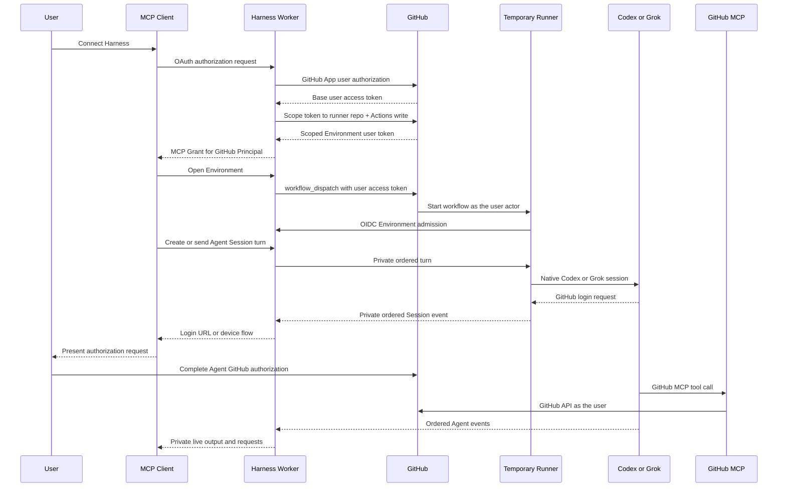

# Multi-user Agent Sessions

Status: implemented; production acceptance remains pending. The organization-owned scavenger remains a non-blocking future decision and is not part of the first release.

## Goal

Harness lets several people use ChatGPT, VS Code, or another MCP Client to control temporary, user-owned development environments. GitHub is the only human identity provider. Each person can run several concurrent Codex or Grok Agent Sessions in one Environment and delegate GitHub work to those Agents.

Harness provides identity, Environment lifecycle, Agent transport, and private event delivery. It does not model issue, branch, commit, push, or pull-request workflows as Harness domain stages.

## Confirmed domain decisions

1. A stable GitHub numeric user ID defines one Harness Principal. Different MCP Clients authorized by the same GitHub account share that Principal.
2. Each MCP Client has its own revocable MCP Grant and scope set. Client identity never owns a Session or Environment.
3. `Harness-X-Harness/runner` is the Execution Repository. Access to another repository does not grant permission to consume its Actions runners.
4. GitHub must see the Harness Principal as the actor that controls an Execution Repository workflow. The control plane uses a GitHub App user token scoped to the runner repository and `Actions: write` to dispatch, observe, and cancel the exact run.
5. The former one-shot Code Task becomes a user-delegated, multi-turn Agent Session. GitHub work is performed through native Agent tools instead of fixed Harness commit and pull-request stages.
6. Agent Sessions run inside the Principal's existing Remote Development Environment. MCP, T3, and Tailscale are interfaces to the same temporary machine.
7. One Environment may run several Codex or Grok Agent Sessions concurrently.
8. Harness does not isolate Session filesystems. Each Session has native conversation state, but users and Agents choose working directories and accept the same filesystem conflicts as on a personal development machine.
9. A user authorizes the Harness GitHub App during MCP authorization. Harness derives an Environment token limited to the fixed Execution Repository and `Actions: write`; the base access token is not retained.
10. The user authorizes `gh`, Git, or GitHub MCP independently inside each admitted Environment. Harness transports interactive login prompts and responses but does not issue, store, refresh, or inject the resulting Agent GitHub credential.
11. GitHub App authorization requests no traditional OAuth repository scope. GitHub's scoped user-token exchange enforces `Harness-X-Harness/runner` plus `Actions: write`; Target Repository access remains outside this Environment authorization boundary.
12. `start_session` expresses one user intent and requires the first task. If the Environment is offline, the control plane starts it, creates the Session, and delivers that task after admission without requiring a separate user step.
13. Harness has no resource scheduler, but it enforces hard safety limits per Environment and Session. Excess input is rejected; recoverable Agent text chunks may be discarded; a non-recoverable overflow terminates only the affected Session with `resource_exhausted`.
14. Native Agent approvals and questions become ordered Session events. The Session waits for one valid response instead of auto-approving or requiring T3.
15. All MCP Grants for a Principal can list that Principal's Sessions. Each Session has one controlling Grant; another Grant can take control only through an explicit, atomic takeover.
16. A Durable Object retains private, ordered Session Events with monotonic cursors. Standard tool reads are the authority; Widget streaming is an optional live view.
17. Reconnect resumes event reading only while the same Environment run remains alive. Environment termination ends native Sessions; a new runner never restores JSONL, workspace, or processes.
18. Terminal Session metadata and events remain read-only for seven days, then are deleted.
19. Loss of Execution Authorization prevents future dispatch, observation, and cancellation through Harness but does not evict an admitted Environment. The current run may continue until the user cancels it in GitHub, it exits, or the six-hour platform limit terminates it. Harness has no installation-token fallback.
20. Ordinary users do not receive Tailscale SSH in the first multi-user release. The current tagged-node access remains a platform-administrator operations interface.
21. Harness drives each Agent through its supported long-lived integration protocol. Codex uses `codex app-server` over local stdio; Grok uses `grok agent stdio` through ACP. The Session transport does not parse TUI output or emulate continuity with repeated one-shot commands.
22. MCP exposes one executor-neutral Agent Session interface. Thin runner-side drivers translate that interface to Codex App Server or Grok ACP; MCP Clients never need to implement either native protocol.
23. The product event stream excludes raw reasoning or thought content. It includes user-visible Agent messages, tool progress, approval and input requests, lifecycle changes, and errors.
24. Reconnect restores coalesced partial Agent output as well as completed semantic events. Runner-side drivers combine high-frequency native deltas into bounded text chunks before appending Durable Object events; Harness does not persist one event per token.
25. The MCP surface has nine Session tools: `start_session`, `list_sessions`, `read_session`, `send_turn`, `cancel_queued_turn`, `interrupt_turn`, `respond_to_session`, `take_over_session`, and `stop_session`. The existing `open_environment` and `close_environment` remain for direct T3 use. Harness does not replace these with a generic action-dispatch tool.
26. `start_session` atomically creates and returns a stable Session ID in `preparing` state before Environment startup completes. Environment allocation, admission, and native driver startup advance that same Session through ordered events; the MCP request does not wait for runner readiness.
27. Session lifecycle uses the small phase set `preparing`, `idle`, `running`, `waiting_for_user`, `stopping`, and `terminal`. A separate `terminalReason` records explicit stop, Environment termination, startup failure, driver failure, or resource exhaustion instead of multiplying terminal phases.
28. `send_turn` supports `delivery: steer | queue`. `steer` adds input to the current native turn; `queue` persists a later turn in the EnvironmentObject and starts it after the current turn completes. Harness is queue authority for both executors; it does not delegate product ordering to Grok's optional native queue extension.
29. `send_turn` defaults to `steer`: it starts a new turn when the Session is idle and steers the exact active turn when it is running. Queueing occurs only when the caller explicitly selects `delivery: queue`.
30. MCP OAuth exposes only `sessions:manage` and `environments:manage`. Harness does not duplicate GitHub repository capabilities as `repos:*`, `issues:*`, or pull-request scopes; GitHub user authorization remains authority for those actions.
31. Agent Sessions are the only code-agent product. There is no fixed one-shot workflow, compatibility fallback, or historical result endpoint.
32. The existing owner-scoped EnvironmentObject is the single authority for the Principal's Environment, Agent Sessions, queued turns, ordered events, controllers, and one multiplexed runner WebSocket. The design does not add one Durable Object per Session.
33. A temporary Environment Control Channel disconnect does not terminate Sessions while the authoritative GitHub run remains non-terminal. The EnvironmentObject exposes separate `channelState`, accepts explicit queued turns, and rejects an immediate steer while disconnected. Only the same generation may reconnect.
34. Every Environment Control Channel command has a stable command ID. The runner records processed command IDs and returns acknowledgements so reconnect can redeliver without repeating a native effect.
35. If `start_session` arrives while the Environment is closing, its Session remains `preparing`. After the EnvironmentObject confirms that the exact old GitHub run is terminal, it dispatches one replacement generation and continues that Session without requiring another user request.
36. `read_session` is the single read authority. It returns a current Session snapshot plus a page of ordered events after an optional cursor, with `nextCursor` and `hasMore`. Final Agent output remains in the event stream; there is no separate result tool.
37. The Session Widget is a live view and narrow contextual command surface. Ordinary turns use the MCP Client's conversation and `send_turn`; the inline Widget does not duplicate that composer. It shows recent bounded output and at most two current actions for a pending request, interruption, takeover, stop, Environment entry, or GitHub run. All nine Session tools remain available through natural-language MCP Client interaction.
38. Durable Session Events retain bounded, user-visible tool summaries and status changes, not complete command stdout, stderr, or tool result bodies. Detailed terminal output remains on the temporary Environment and its direct interfaces.
39. Explicit queued turns form a FIFO. `send_turn` returns a stable turn ID, and `cancel_queued_turn` may cancel that exact turn only before it becomes active.
40. `interrupt_turn` interrupts one exact active turn while preserving its native Agent Session and queued turns. `stop_session` remains the whole-Session terminal operation.
41. Agent GitHub Authorization is generation-local. Its credentials exist only inside the user's temporary Environment and are destroyed with it; users authenticate again in a replacement Environment.
42. The first release supports only native browser URL or device-code flows for Agent GitHub Authorization. Harness does not accept PATs or GitHub tokens through a Widget, MCP tool, Session Event, or control-channel command.
43. `start_session` accepts an optional `workingDirectory` and requires an initial prompt. The default working directory is the Environment user's native home. Harness does not create a workspace or checkout a Target Repository. A user who only wants a ready machine calls `open_environment` instead of creating an empty Agent Session.
44. Stopping the last Agent Session does not close the shared Environment. Only explicit `close_environment`, direct GitHub termination, or the platform run limit ends T3 and other user processes.
45. Codex and Grok continue to use platform-managed shared Mini provider credentials. Every admitted Environment can use and potentially read those credentials; the product relies on trusted-organization membership rather than process-level secret isolation.
46. Each Harness Agent Session owns one independent native stdio child process: `codex app-server` for Codex or `grok agent --no-leader stdio` for Grok. Processes still share the Environment user's home, credentials, and filesystem; this is lifecycle and fault separation, not a security boundary.
47. One long-lived Node 24 `session-runtime` Action replaces the separate ready callback and `sleep infinity`. It opens the control channel, atomically publishes Environment readiness, supervises driver processes, and keeps the workflow alive. The early OIDC claim remains a separate pre-secret admission gate.
48. Integrations prefer stable surfaces: Cloudflare's hibernatable WebSocket server API, Codex App Server's stable stdio API without experimental capability opt-in, and standard Grok ACP. Grok steering uses the required `x.ai/interject` extension; drivers discover required capabilities at initialization and fail explicitly when absent, with no semantic fallback.
49. The first release relays structured GitHub MCP OAuth URLs through Session requests. Users complete `gh` and Git credential device login in the Environment's T3 terminal. Harness does not parse CLI login output or proxy GitHub tokens.
50. GitHub App user authorization identifies the Harness Principal but does not separately prove `Harness-X-Harness` organization membership or preflight runner permission. The scoped-token exchange and first real `workflow_dispatch` are the Execution Authorization gates, so Harness does not request organization membership or maintain a duplicate membership decision.

## Identity and authority model

| Concept | Authority | Purpose |
| --- | --- | --- |
| MCP Client | CIMD, DCR, or preregistration | Identifies ChatGPT, VS Code, or another client application |
| MCP Grant | Harness OAuth provider | Gives one Client a revocable scope set for one Principal |
| Harness Principal | GitHub numeric user ID | Owns Environments and Agent Sessions across all Clients |
| Execution Authorization | Repository- and permission-scoped GitHub App user token plus GitHub Actions policy | Decides whether the Principal may dispatch, observe, or cancel work in the Execution Repository |
| Environment Admission | Exact GitHub run plus GitHub Actions OIDC | Binds one workflow run to the current Principal generation |
| Agent GitHub Authorization | User-completed login inside the Environment | Lets native GitHub tools act with the user's selected GitHub credential for this generation |
| Session Controller | One MCP Grant at a time | Serializes turns and user responses without making the Client the Session owner |

Repository membership and Execution Authorization are not synonyms. GitHub App user authorization establishes identity; scoped-token exchange establishes the requested capability ceiling. The authoritative admission operation remains the scoped-user-token `workflow_dispatch`: GitHub evaluates repository access, App permission, Actions policy, and workflow protections with the real Principal as actor. A separate membership or repository preflight cannot fully predict that result and could become stale before dispatch.

## Target flow



GitHub Actions does not automatically expose the triggering user's credential to a job. The job's built-in `GITHUB_TOKEN` remains a repository-scoped GitHub Actions App installation token. Harness does not forward its dispatch credential. The user establishes separate Agent GitHub Authorization inside the admitted Environment when GitHub work is required.

## Runtime control channel

After OIDC admission, the runner opens one outbound WebSocket to its owner's EnvironmentObject. The connection is authenticated and bound to the exact Environment generation and GitHub run. It multiplexes commands for all native Agent drivers and returns their normalized events. The runner does not accept a public inbound control connection.

The long-lived `session-runtime` Node Action reads the private T3 descriptor, opens this WebSocket with a fresh GitHub Actions OIDC assertion, and makes `ready` plus `channelState: connected` one EnvironmentObject commit. It replaces both the former ready callback and `sleep infinity`. The earlier claim Action remains separate because it is the admission boundary before shared executor credentials, private networking, or T3 startup.

The EnvironmentObject accepts the connection with Cloudflare's hibernatable WebSocket API. It remains the server and single serialization point while the runner is the reconnecting client. The channel carries only Harness Session commands and events; MCP bearer tokens, the Harness GitHub OAuth token, T3 pairing data, and raw Agent reasoning do not enter it.

The runtime sends the validated T3 descriptor through one OIDC-authenticated HTTPS preparation request. The later WebSocket handshake carries a fresh OIDC assertion in `Sec-WebSocket-Protocol`, not in the URL. `EnvironmentObject` consumes the private preparation only when that handshake proves the same owner, generation, repository, workflow, run ID, and run attempt. It publishes Ready and `channelState: connected` together only after accepting the hibernatable socket. Only the fixed non-secret application protocol is selected in the handshake response.

T3 and Tailscale remain independent user and administrator interfaces. Neither is required for MCP Session control.

A disconnected channel is an observation about transport, not proof that the GitHub run or native Agent process ended. The EnvironmentObject keeps Session phases and reports `channelState: disconnected`. It may durably accept an explicit queued turn, but an immediate steer fails instead of silently changing delivery mode. A WebSocket from another generation cannot adopt the Sessions.

Commands use stable IDs and acknowledgements. The runner keeps a generation-local receipt journal so loss of an acknowledgement cannot repeat a native start, turn, steer, approval response, or stop effect. This is an at-least-once transport with idempotent command handling, not an exactly-once network claim.

## Security boundary

The Remote Development Environment is the Principal's temporary machine, not a process sandbox. Repository code, Codex, Grok, T3, GitHub MCP, shells, and other user-started processes can act within the same Unix-user boundary and may reach credentials that the user creates inside the Environment. This is intentional for the user-controlled temporary-machine model and must not be described as per-Agent credential isolation.

The Environment receives neither the MCP bearer nor the Harness GitHub OAuth token. Agent GitHub credentials are exchanged directly between tools in the Environment and GitHub; the control plane carries only private human-facing authorization requests, choices, and status, never the resulting GitHub credential.

The platform does inject shared Codex and Grok provider credentials after Environment admission. These are organization service credentials, not user identities. Repository code and any process in the user's Environment may read or use them. Platform operators own their rotation, provider cost, and revocation.

## Current implementation

The implementation has one Environment workflow, one owner-scoped Durable
Object authority, one multiplexed runtime channel, and native Codex and Grok
drivers. Agent Sessions are the only code-agent interface. Harness has no fixed
checkout, commit, push, or pull-request pipeline and no target-repository
installation path.

One GitHub App provides user identity and a scoped user token for Environment
workflow control. The base access token is not retained. There is no App JWT,
installation token, PAT, or platform-owned GitHub fallback.

Traditional OAuth `repo` scope is broader than the target operations. The implementation must enforce the fixed Execution Repository at its GitHub adapter boundary and must not reuse this token for Target Repository access, Agent GitHub Authorization, or general GitHub tools.

## Confirmed interaction semantics

- `start_session` automatically opens an offline Environment and waits for admission before starting the native Session.
- Several Sessions may run concurrently in one Environment. Harness does not queue or schedule them.
- Users and Agents select working directories. Session JSONL records isolate native conversation state, not Git working trees or files.
- Native approval, question, and authorization requests enter `waiting_for_user` and are delivered as private ordered events.
- The Grant that creates a Session is its initial Session Controller. Only the controller may send turns or answer requests.
- `list_sessions` returns every Session owned by the Principal, including controller display metadata, but not transcripts or credentials.
- Another Grant for the same Principal may explicitly take over a Session. Takeover atomically invalidates the old controller for future writes; there is no controller timeout lease.
- Session Events have monotonic cursors. Clients reconnect from their last cursor; an optional Widget stream cannot replace durable reads.
- Agent text deltas are coalesced into bounded durable chunks. A reconnect can recover partial output without treating every model token as an event.
- Environment termination makes all native Sessions terminal. Their events remain read-only for seven days, but no Session or workspace is restored on another runner.

## Native driver boundary

Harness exposes one product-level Agent Session model while each driver keeps its native protocol and identifiers.

| Product operation | Codex driver | Grok driver |
| --- | --- | --- |
| Start native conversation | `thread/start` | `session/new` |
| Continue conversation | `turn/start` on the same thread | `session/prompt` on the same session |
| Steer current turn | `turn/steer` with the expected turn ID | `x.ai/interject` extension for the active session |
| Stream work | `turn/*` and `item/*` notifications | `session/update` notifications |
| Ask for approval or input | Server-initiated approval and user-input requests | ACP permission requests |
| Reconnect the control channel while runner lives | Keep the same app-server child and loaded thread | Keep the same ACP child and native session |

Codex App Server is the supported rich-client interface for conversation history, approvals, and streamed Agent events. Its stdio transport is newline-delimited JSON and is suitable for a local runner-side adapter. The App Server WebSocket transport is experimental and is not required by this design.

Grok Agent Mode is a long-lived ACP server. Its stdio transport provides sessions, repeated prompts, structured streamed replies, tool-call updates, reasoning updates, and permission prompts. Harness uses standard ACP plus only the required `x.ai/interject` steering extension. Harness keeps queue authority and does not use Grok's optional native queue extension.

The common driver contract must stay semantic and small: start a native Session for a working directory, send one turn, answer one pending request, stop the Session, and emit normalized Session Events. It must not hide native event fields that are required to make a safe approval decision. Raw native reasoning and thought streams are discarded at the driver boundary.

Harness owns queued-turn ordering because Codex has native steering but no equivalent product queue, while Grok exposes queueing only through optional `x.ai/*` extensions. The product does not split ordering authority across a Durable Object and one executor process. A driver accepts only the next committed turn or a steer for the exact active native turn.

## MCP tool surface

| Tool | Intent |
| --- | --- |
| `start_session` | Create one Codex or Grok Session, opening the Principal's Environment when necessary |
| `list_sessions` | List the Principal's active and retained terminal Sessions without transcripts |
| `read_session` | Return one Session snapshot and ordered events after an optional cursor |
| `send_turn` | Send one user turn through the current Session Controller |
| `cancel_queued_turn` | Cancel one exact queued turn before it becomes active |
| `interrupt_turn` | Interrupt one exact active turn without terminating the Agent Session |
| `respond_to_session` | Answer one pending Agent approval, question, or authorization request |
| `take_over_session` | Atomically make the caller's MCP Grant the Session Controller |
| `stop_session` | Stop one native Session without closing the shared Environment |
| `open_environment` | Open or return the Principal's Environment for direct T3 use |
| `close_environment` | Close the Environment and all Sessions inside it |

Each tool represents one user intent. A generic tool with an `action` discriminator is not used because it would merge read, write, takeover, and destructive authorization semantics.

## Session Widget

The Session Widget renders one Session snapshot and its ordered event timeline. It receives an encrypted, ten-minute, Session- and Grant-bound stream capability only in private MCP result metadata. The capability token does not enter the stream URL, structured content, text, logs, or Session Events. The edge decrypts it only to route the read to the owner `EnvironmentObject`; the direct stream route has no mutation operation.

The Widget consumes private NDJSON updates and reconnects from its last durable cursor. Each update contains the same safe snapshot projection plus only events after that cursor. Durable `read_session` remains the read authority: an expired capability causes the Widget to obtain a new capability through `read_session`, and cursor deduplication prevents reconnect from rendering a committed chunk twice.

The Widget provides:

- executor, Session phase, controller summary, working directory, and connection state;
- the five most recent coalesced Agent, user, activity, request, or error groups;
- one primary and at most one secondary contextual action;
- controls for a pending approval, question, or authorization request;
- explicit `Take control`, interruption, stop, Environment entry, or GitHub run when applicable.

The public snapshot returns server-computed `allowedActions` and
`allowedTurnDeliveries`. Widget actions call the same MCP tools as natural-
language clients. The Widget is not state authority and cannot bypass
controller, owner, generation, scope, or pending-request checks. It uses the
standard MCP Apps bridge; ChatGPT theme signals are optional progressive
enhancement and are not required by other MCP Clients.

## Session lifecycle

```text
preparing -> idle -> running -> idle
                         \-> waiting_for_user -> running
any non-terminal phase -> stopping -> terminal
Environment terminal or unrecoverable startup/driver/resource failure -> terminal
```

`terminalReason` carries the cause without changing the lifecycle phase model. Terminal Sessions are immutable except for retention cleanup.

## Session read contract

`read_session` returns one private snapshot and an event page:

```ts
type SessionSnapshot = {
  sessionId: string;
  executor: "codex" | "grok";
  phase: "preparing" | "idle" | "running" | "waiting_for_user" | "stopping" | "terminal";
  terminalReason?: "stopped" | "environment_ended" | "startup_failed" | "driver_failed" | "resource_exhausted";
  channelState: "connected" | "disconnected";
  controller: { clientName: string; currentGrant: boolean };
  workingDirectory: string;
  activeTurnId?: string;
  queuedTurns: Array<{ turnId: string; createdAt: string }>;
  pendingRequests: Array<{ requestId: string; kind: string }>;
  latestCursor: number;
  environment: { status: string; entryUrl: string; runUrl?: string };
  createdAt: string;
  updatedAt: string;
};

type SessionRead = {
  session: SessionSnapshot;
  events: SessionEvent[];
  nextCursor: number;
  hasMore: boolean;
};
```

The snapshot is a current projection, not a second history authority. Native Codex thread IDs and Grok session IDs remain only in the generation-local runner registry and are deleted when the Session becomes terminal.

Every event has `{ cursor, sessionId, type, createdAt, data }`. `cursor` is strictly increasing within one Harness Session. The normalized event types are:

| Type | Durable content |
| --- | --- |
| `status` | Session phase, channel state, controller change, or terminal reason |
| `user_message` | Exact user text, turn ID, and `steer` or `queue` delivery |
| `agent_message_chunk` | Coalesced user-visible Agent response text |
| `activity` | Bounded tool label, safe target or command summary, status, and error summary |
| `request` | Exact request ID, open or resolved state, safe description, allowed choices, and optional input schema |
| `turn` | Queued, started, completed, interrupted, or cancelled state for one turn ID |
| `error` | User-facing transport, Session, turn, or driver error summary |

Raw reasoning, native protocol payloads, full stdout or stderr, credentials, T3 descriptors, control-channel capabilities, and GitHub authorization tokens are not Session Events. A request response must name an open `requestId` and one of that event's declared `choiceId` values; the driver translates it to the native response.

Final output is the final `agent_message_chunk` sequence followed by the terminal `turn` or `status` event. There is no synthetic Task result or separate result endpoint.

## Tool argument contract

The public tools use Harness IDs only:

```text
start_session(executor, initialPrompt, workingDirectory?)
list_sessions()
read_session(sessionId, afterCursor?, limit?)
send_turn(sessionId, text, delivery = "steer")
cancel_queued_turn(sessionId, turnId)
interrupt_turn(sessionId, activeTurnId)
respond_to_session(sessionId, requestId, choiceId, values?)
take_over_session(sessionId)
stop_session(sessionId)
open_environment(operation = "open" | "observe")
close_environment()
```

`open` is an explicit user mutation. `observe` is reserved for side-effect-free
Widget refresh and cannot create a generation or dispatch a workflow. The
required discriminator also makes a cached client with the old empty argument
contract fail closed.

`cancel_queued_turn` fails after its turn starts. `interrupt_turn` fails when `activeTurnId` is stale. `respond_to_session` fails after its exact request resolves. `steer` starts a new turn only when the Session is idle; it fails while the control channel is disconnected. Explicit `queue` remains durable while the channel is disconnected.

`list_sessions` returns metadata only. Reading a transcript always requires `read_session`. All Session tools require `sessions:manage`; Environment tools require `environments:manage`.

## Resource containment

Resource safety is local to one Environment generation and one Session. It is
not a CPU or memory scheduler and does not isolate files or provider
credentials.

| Boundary | Limit | Overflow behavior |
| --- | ---: | --- |
| Active Sessions and native drivers per Environment | 8 | Reject creation before a ninth Session is admitted; runner-side driver admission independently fails the new Session only. |
| Explicit queued turns per Session | 16 | Reject the new turn with HTTP 429 and terminate that Session as `resource_exhausted`. |
| Accepted command identities per Session | 256 | Reject another command before a native effect and terminate that Session. Duplicate delivery of an existing ID remains idempotent. |
| Retained Session Events | 512 | Keep one terminal-event slot. At the normal limit, remove the oldest recoverable `agent_message_chunk` before appending newer output or control state. If only non-recoverable events remain, terminate the Session. Event cursors remain monotonic and are not reused. |
| Disconnected runner outbox per Session | 64 messages | Replace the oldest recoverable Agent chunk with newer output. If a non-recoverable control message cannot fit, stop that Session driver, discard its pending outbox, and retain one terminal transition. Other Sessions keep the shared channel. |

The owner-scoped Durable Object is still the serialization authority. A local
resource terminal returns 429 to the rejected operation but does not close the
multiplexed Environment Control Channel. Identity, generation, protocol, and
state mismatches remain channel-fatal because they invalidate the shared
transport authority.

## Explicit exclusions

- no cross-Environment native Session resume;
- no Harness-managed repository checkout, branch, commit, push, issue, or pull-request stages;
- no PAT input or GitHub token transport;
- no ordinary-user Tailscale SSH;
- no per-Session filesystem, Unix-user, or provider-credential isolation;
- no application queue for allocating runner CPU or memory;
- no legacy Code Task API, storage, workflow, Widget, or fallback.

## Open decision

- Decide whether orphaned Environment runs need a separate organization-owned scavenger. A possible admin PAT would be a platform authority, not the Principal's Execution Authorization. Before adoption, define its least possible permissions, orphan proof, exact-run targeting, audit trail, rotation, revocation, and protection against cancelling a live run still owned by a valid Principal. It is not part of the first OAuth-only command path and must not act as an inline retry or fallback.

## Formal evidence

Three focused obligation models cover the concurrency boundaries that the
single-Session model deliberately omits. They are independent models, not one
`AllSystem` model and not a claim of full implementation refinement.

[`PrincipalIsolation.tla`](../../formal/PrincipalIsolation.tla) uses two
Principals, two owner-indexed Environments, and two unique GitHub run
identities. It checks `NoCrossOwnerMutation`, `ExactOwnerCancel`, and
`OneActiveRunPerOwner`. Ready and terminal evidence are external actions with
no fairness. Weak fairness applies only to a local commit after relevant
evidence exists. A concurrent Close may supersede ready evidence; Offline then
still requires terminal evidence from GitHub. The positive finite
configuration generated 5,617 states, found 1,377 distinct states, and reached
depth 15. Three negative configurations route a callback to the wrong owner,
cancel another owner's run, or create a second active run; each violates its
target invariant at depth 3.

[`MultiSessionTransport.tla`](../../formal/MultiSessionTransport.tla) uses one
Environment generation, two Sessions, two Clients, two commands, and one
possible disconnect. It checks `NoCrossSessionEffect`,
`AtMostOncePerSessionCommand`, `SessionFailureIsLocal`, and `GenerationGate`.
The conditional progress property requires explicit channel-availability and
driver-response evidence before it requires an accepted command to reach ACK
or a terminal Session. The positive configuration generated 110,941 states,
found 33,300 distinct states, and reached depth 18. Wrong-session failure,
duplicate effect, and stale-generation negative configurations violate their
target invariants at depths 2, 6, and 4.

[`BoundedSessionResources.tla`](../../formal/BoundedSessionResources.tla) uses
two Sessions with queue capacity 1, outbox capacity 2, event capacity 3, one
driver slot, and two input identities. These are discriminating model values,
not production limits. It checks every resource bound, stable terminal state
after overflow, and FIFO delivery of retained control messages after
reconnect. Recoverable chunks may be dropped. The positive configuration
generated 3,493,602 states, found 456,964 distinct states, and reached depth
19. Negative configurations grow the outbox past its limit, revive an
overflowed Session, or deliver retained controls out of order; they violate
their target invariants at depths 5, 4, and 7.

All three positive configurations were exhaustively checked with TLA+ Tools
1.7.4 / TLC 2.19. They use no state constraints, symmetry sets, or semantic
overrides. Deadlock checking is disabled because offline, terminal, waiting,
and externally blocked states are valid quiescent states. The checks prove only
the declared finite abstractions. They do not prove Cloudflare delivery,
GitHub evidence arrival, driver response, or real-time availability.

The controlled implementation traces use the same ownership and failure
boundaries:

| Obligation | Implementation and test evidence |
| --- | --- |
| Principal isolation | Every Environment and Session request routes through `ENVIRONMENTS.idFromName("github-" + ownerId)`. Callback identity selects that same owner key, and the exact generation/run gates reject a mismatched callback or cancellation. Owner-scoped store tests use two owners and prove that neither Session list contains the other owner's records. |
| Multi-Session transport | One `SessionRuntime` multiplexes two Session IDs while its driver registry keeps one child per ID. Controlled tests deliver commands for both Sessions, reject stale generation, suppress duplicate native effects, and prove one Session's outbox or driver-capacity failure leaves the other driver and queued message intact. |
| Resource containment | Tests force small runner outbox, receipt, and driver limits and production-sized control-plane queue, command, and event limits. They prove input rejection, recoverable chunk eviction, stable `resource_exhausted`, and a non-fatal shared-channel 429. |

[`AgentSessions.tla`](../../formal/AgentSessions.tla) is a focused requirements model for one representative Agent Session. It checks controller authority, exact Environment generation, FIFO queued turns, cancellation before start, terminal monotonicity, and at-most-once native effects over at-least-once command delivery. OAuth, GitHub dispatch, T3, Tailscale, text content, driver payloads, and eventual external progress are outside this obligation.

The exhaustive finite configuration uses two Grants, two Turns, two Commands, and two Environment generations. These cardinalities preserve the identities needed for takeover, two-turn FIFO ordering, command redelivery, and a stale generation. It uses no state constraints, symmetry set, or semantic overrides. Deadlock checking is disabled because terminal and quiescent Sessions are valid product states; no liveness claim is made for GitHub responses or WebSocket reconnection.

TLA+ Tools 1.7.4 with TLC 2.19 generated 669,511 states, found 197,116 distinct states, reached depth 18, and found no invariant violation. Two negative configurations demonstrate adequacy: [`AgentSessionsDuplicateFaulty.cfg`](../../formal/AgentSessionsDuplicateFaulty.cfg) repeats a processed command and violates `CommandEffectsAtMostOnce` at depth 4; [`AgentSessionsAuthorityFaulty.cfg`](../../formal/AgentSessionsAuthorityFaulty.cfg) accepts an old-controller write and violates `AcceptedCommandsWereAuthorized` at depth 3. The positive configuration is [`AgentSessions.cfg`](../../formal/AgentSessions.cfg).

The controlled implementation trace is [`session-state.js`](../../apps/chatgpt-app/src/session-state.js), reached only through the owner-scoped `EnvironmentObject`:

| Model identity or transition | Implementation evidence |
| --- | --- |
| `sessionGeneration` and `envGeneration` | Every mutation carries the exact stored `generation`; `terminateGenerationSessions` changes only matching non-terminal Sessions. |
| `controller` and `TakeOver` | `controllerGrantId` is replaced in the same Durable Object transaction; later controller writes compare against the committed value. |
| `queue`, `QueueTurn`, and `CancelQueuedTurn` | `queuedTurns` is a durable ordered list; `start_queued` removes only its head and cancellation accepts only an ID still in that list. |
| `CompleteAndStartQueued` | One Durable Object transaction records completion of the exact active turn, removes the FIFO head, starts it, and journals one stable `start_queued` command. No observable idle state or second client command exists between those effects. |
| `accepted`, `processed`, and `effectCount` | Stable command IDs index a durable command journal; same-ID same-payload delivery is idempotent, conflicting payloads fail, and processed commands leave the pending command view exactly once. |
| `eventCount` and `lastEventGeneration` | Per-Session event keys use a strictly increasing durable cursor and every append passes the Session generation gate. |
| `EnvironmentTerminates` and `TerminalIsSticky` | Exact Environment terminal and confirmed startup-failure paths make matching Sessions terminal; all later mutations fail until seven-day cleanup deletes the immutable record. |
| `channelState` and `channelGeneration` | [`environment-channel.js`](../../apps/chatgpt-app/src/environment-channel.js) admits only the current generation, run ID, and run attempt; the WebSocket attachment survives Durable Object hibernation and stale socket close events cannot disconnect a replacement. |
| `deliveryCount`, `processed`, and `effectCount` | The server redelivers unacknowledged stable command IDs. The generation-local [`session-runtime`](../../.github/actions/session-runtime/index.js) records a receipt before one native effect and acknowledges duplicate delivery without invoking that effect again. If the runtime process ends, the Environment run ends; receipts are never resumed in another generation. |
| Driver admission and `StartTurn` | The runner starts exactly one [`codex app-server`](../../.github/actions/session-runtime/codex-driver.js) or [`grok agent --no-leader stdio`](../../.github/actions/session-runtime/grok-driver.js) child per Session. After native conversation creation, `admit` reaches modeled `idle`; the required initial prompt then uses `begin_turn`, which refines to the model's `StartTurn`. |
| Native completion and user requests | Each driver normalizes only bounded public events. Native completion sends an exact-turn `complete_turn`; server-initiated approval or input sends exact-turn `wait_for_user`. Reasoning, thought, raw protocol payloads, and native IDs do not cross the driver boundary. |

`start_session` reaches one aggregate operation in `EnvironmentObject`. The same
transaction chooses the current Environment generation or reserves exactly one
replacement generation and creates the stable `preparing` Session. GitHub
workflow dispatch is a later effect. A Session created while the old generation
is `closing` remains bound to the reserved replacement; authenticated Session
reads reconcile the old run and dispatch that replacement without a second user
request.

The implementation adds `preparing` before the model's admitted `idle` initial state. It permits one generation-bound driver-start command to create the native conversation, but no model turn begins before runner admission. The `admit` transition is the refinement mapping into the model's initial `idle`; `begin_turn` maps the required public initial prompt to `StartTurn`. Internal state still has a valid idle transition between admission and turn start. Retention deletion occurs after the modeled terminal history and is outside the model. The HTTP request adapter, Durable Object storage, pagination, timestamps, text, and event schemas do not add state transitions to the focused obligation.

[`SessionWidgetTakeover.tla`](../../formal/SessionWidgetTakeover.tla) checks a
separate adapter obligation for two MCP clients. It models host approval,
denial, Durable Object commit or rejection, a delayed or lost tool response,
and a newer stream observation. Arbitrary delay is stuttering; the model adds
no clock, timeout, lease, or progress claim. It is not a refinement of the
complete Agent Session model.

The positive configuration uses two clients and two controller changes. It
uses no state constraints, symmetry set, or semantic overrides. TLC generated
958 states, found 330 distinct states, reached depth 12, and found no invariant
violation. Deadlock checking is disabled because a pending approval, a lost
response, and a quiescent Session are legal without a liveness assumption. The
negative configuration applies a delayed tool response unconditionally and
violates `ViewCursorNeverRegresses` at depth 9 after one client has already
observed the other client's newer takeover. The implementation obligation is
the `renderSession` cursor gate in
[`session-widget.js`](../../apps/chatgpt-app/src/session-widget.js); the
controlled Widget test reproduces that exact event order.

## Primary references

- [MCP authorization](https://modelcontextprotocol.io/specification/2025-11-25/basic/authorization)
- [GitHub workflow dispatch](https://docs.github.com/en/rest/actions/workflows#create-a-workflow-dispatch-event)
- [GitHub workflow runs](https://docs.github.com/en/rest/actions/workflow-runs)
- [GitHub OAuth App scopes](https://docs.github.com/en/apps/oauth-apps/building-oauth-apps/scopes-for-oauth-apps)
- [GitHub App and OAuth App differences](https://docs.github.com/en/apps/oauth-apps/building-oauth-apps/differences-between-github-apps-and-oauth-apps)
- [GitHub workflow execution protections](https://docs.github.com/en/repositories/managing-your-repositorys-settings-and-features/actions-policies/workflow-execution-protections)
- [GitHub Actions `GITHUB_TOKEN`](https://docs.github.com/en/actions/concepts/security/github_token)
- [GitHub Actions OIDC claims](https://docs.github.com/en/actions/reference/security/oidc)
- [Cloudflare Durable Object WebSocket hibernation](https://developers.cloudflare.com/durable-objects/best-practices/websockets/)
- [Official GitHub MCP Server OAuth](https://github.com/github/github-mcp-server/blob/main/docs/oauth-login.md)
- [Codex App Server](https://developers.openai.com/codex/app-server/)
- [Grok Agent Mode and ACP](https://github.com/xai-org/grok-build/blob/main/crates/codegen/xai-grok-pager/docs/user-guide/15-agent-mode.md)
- [Grok Build MCP configuration](https://github.com/xai-org/grok-build/blob/main/crates/codegen/xai-grok-pager/docs/user-guide/05-configuration.md#mcp-servers)
